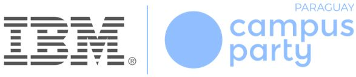

# Workshop - Recicla con Watson

En este workshop haremos uso de las APIs de Watson de IBM, en particular las que nos habilitan a reconocer imágenes: **Watson Image Recognition**

Al terminar este workshop el participante comprenderá como hacer lo siguiente:

* Crear clasificadores de imágenes de forma programática usando el SDK de NodeJs
* Definir una aplicación web en NodeJs para captura de imágenes
*
## Características del taller

* **Nivel de skill**: Cualquier nivel de skill

Se requiere conocimientos básicos de Git e IBM Cloud.

## Requisitos ##

* Cuenta en IBM Cloud - Crea tu IBMid desde este enlace https://ibm.biz/BdzJFA
* Cuenta en Github - Creat tu ususario desde este enlace https://github.com

Para todos los efectos del taller se debe usar la región _`Dallas (US-South)`_

## Introducción ##

El servicio IBM Watson Visual Recognition utiliza algoritmos de aprendizaje profundo para analizar imágenes de escenas, objetos y otro contenido. IBM Watson Studio proporciona un entorno de colaboración en la nube donde puede trabajar con sus imágenes y sus modelos personalizados de reconocimiento visual.

Para nuestro ejemplo, crearemos un clasificador que identifique si el objeto capturado es compostable, reciclable o simplemente tendrá que ir a algún vertedero. La arquitectura que utilizaremos para nuestro taller


El flujo que se desarrolla es como sigue:

1. El cliente envia una imágen en formato jpg a través de la Aplicación
2. La aplicación envia la imágen al servicio de Watson Image recognition
3. La API de Watson procesa la imagen y determina la clasificación que aplica a la imagen

Los componentes Empleados son:

* [IBM Watson Image Recognition](https://www.ibm.com/cloud/watson-visual-recognition)
* [Node.js](https://nodejs.org/)

## Paso a paso ##

### Preparación ###

Los siguientes pasos deben realizarse usando un usuarios con privilegios de administración

1. Descargar la CLI de IBMCloud siguiendo estas [instrucciones ](https://cloud.ibm.com/docs/cli?topic=cloud-cli-install-ibmcloud-cli)
2. Instalar NodeJs siguiendo las instrucciones de esta [página](https://nodejs.org/es/download/current/)
3. Validar que la CLI de IBM Cloud está operativa

```
$ ibmcloud -v
ibmcloud version 0.19.0+94101c85-2019-09-23T03:46:57+00:00
```

4. Validar que la CLI de NodeJs y NPM están operativas

```
$ node -v
v12.10.0
$ npm -v
6.10.3
```

### Creación del servicio de Reconocimiento de imágenes

1. Crea un servicio de Watson Visual Recognition desde el dashboard de [IBM Cloud](https://cloud.ibm.com) con tu cuenta y colocale el siguiente nombre `wvda-visual-recognition`
2. Presiona el botón `Launch Watson Studio` para acceder a la configuración de los servicios de reconocimiento y clasificación

### Instalación Aplicación Web ###

1. Crear directorio de trabajo (Por ejemplo ~/lab/)

```
$ cd ~
$ mkdir lab
```
2. Clonar el [repositorio](https://github.com/surasiterix/watson-waste-sorter.git) para descargar los artefactos del taller

```
$ cd lab
$ git clone https://github.com/surasiterix/watson-waste-sorter.git
```
3. Definir nombre único para la aplicación en el archivo [`manifest.yml`](manifest.yml).

``` yaml
---
declared-services:
  wvda-visual-recognition:
    label: watson_vision_combined
    plan: lite
applications:
- path: ./server
  memory: 256M
  instances: 1
  name: watson-vehicle-damage-analyzer
  disk_quota: 512M
  random-route: false
  services:
  - wvda-visual-recognition

```

4. configurar variables de entorno en `.env`

```yaml
# Replace the credentials here with your own.
# Rename this file to .env before starting the app.

# Watson Visual Recognition
VISUAL_RECOGNITION_IAM_APIKEY=<API key del servicio>
```

5. Instalar la app local usando NPM

```
$ npm install
```

### Ejecución Local ###

1. Levantamos nuestra Web app

```
$ npm start
```

2. Accedemos a la aplicación usando un browser a la siguiente dirección http://localhost:3000

3. Revisemos el comportamiento del clasificador

### Subamos nuestra aplicación a la Nube ###

1. Iniciemos la CLI de IBM cloud

```
$ ibmcloud login
```

2. Definamos nuestro target a aplicaciones Cloud Foundry usando este comando

```
$ ibmcloud target --cf
```

3. Subamos nuestra app a IBM cloud

```
$ ibmcloud app push
```

4. A Reciclar!

# Contactos #

Siguenos en twiiter [@IBMUruguay](https://twitter.com/IBMUruguay)
